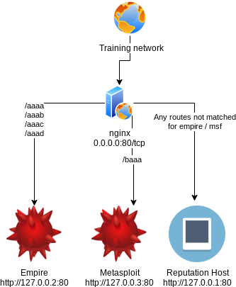

= Infra demo
Brandon Ingalls <brandon@tr4.dev>
v0.1.0, 2019-11-18
:toc:

== Bottom Line

WARNING: This demo is pretty rough around the edges, I do plan to go back through and clean this up sometime in the future.

This repo is meant to be a quick example of how https://docs.docker.com/[docker] and https://docs.docker.com/compose/[docker-compose] can be used to quickly prototype things for red team operations.

== Background

=== What do we build?

. Nginx Proxy
** Routes incoming web traffic to our tools
. Empire
. Metasploit

=== Diagram

.Basic outline

=== Using the environment

. Install docker and docker-compose
. Sync this git repo
. Modify config files as required
+
NOTE: This is where you would provide your IP / hostname to the config files.
+
. Build environment
+
.docker-compose up
----
# Start the docker containers in the background
[~]$ docker-compose up -d
----
+
. docker `exec` into the tool you want to use
+
.docker attach
----
# Locate the empire container name
[~]$ docker ps | grep empire

# Attach to the empire container
[~]$ docker attach example_empire_1

# Locate the msf container name
[~]$ docker ps | grep msf

# Attach to the msf container
[~]$ docker attach example_msf_1
----
+
NOTE: Ctrl + p + q is the docker detach https://docs.docker.com/engine/reference/commandline/attach/[sequence]; this will allow you to back out of a container without killing it.
